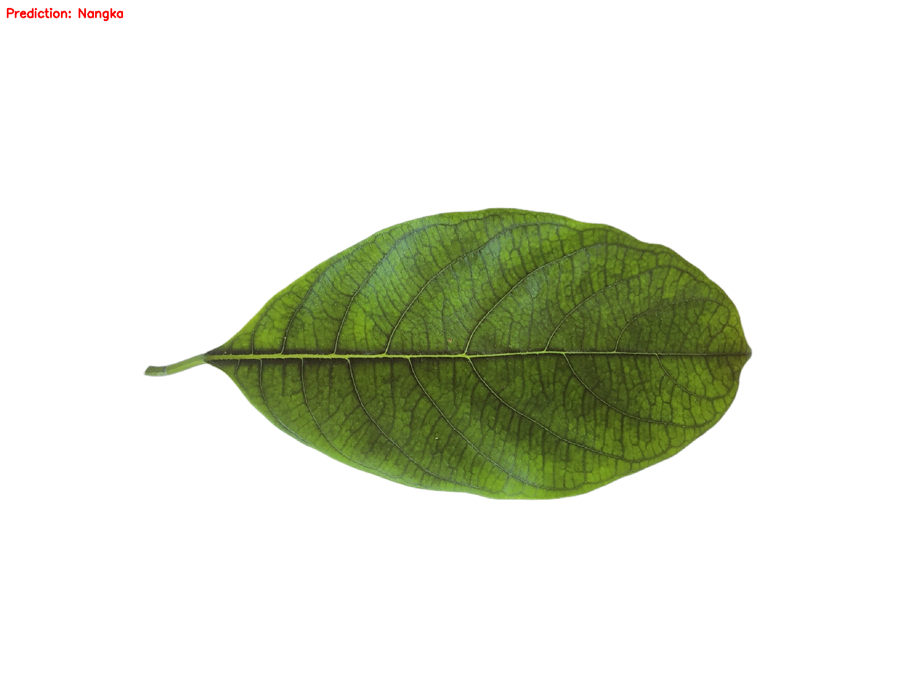
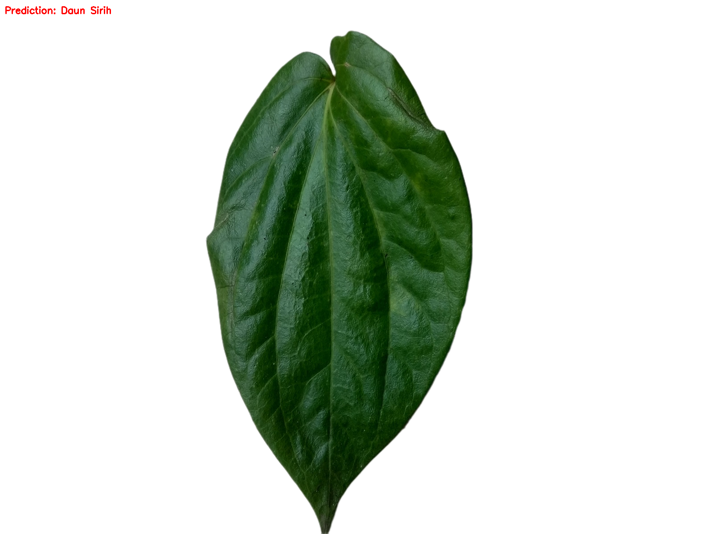

## UTS Pengolahan Citra Digital Menggunakan Algoritma SVM
Support Vector Machine (SVM) adalah metode machine learning yang digunakan untuk melakukan klasifikasi maupun regresi dengan cara mencari garis atau bidang pemisah terbaik (hyperplane) yang memisahkan data dari kelas yang berbeda. SVM berusaha menemukan batas pemisah dengan jarak terlebar (margin terbesar) agar hasil prediksi lebih akurat. Titik-titik data yang paling dekat dengan batas tersebut disebut support vectors karena menentukan posisi garis pemisah. Selain itu, SVM juga dapat menggunakan fungsi kernel seperti linear, polynomial, dan RBF untuk menangani data yang tidak dapat dipisahkan secara linear
https://drive.google.com/drive/folders/1VDIaviscBbGRLghTMXbheYXUDGHKbr8l?usp=sharing
| No | Keterangan | Gambar |
|----|-------------|--------|
| 1  | Daun Nangka |  |
| 2  | Daun Sirih |  |